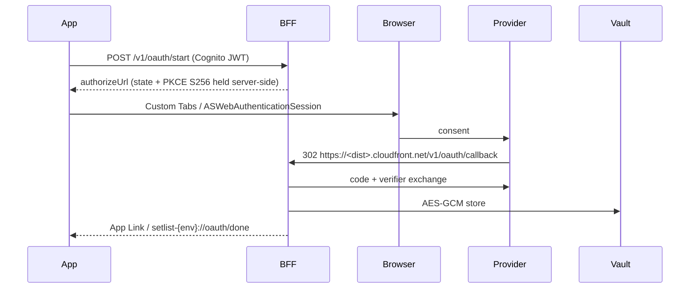
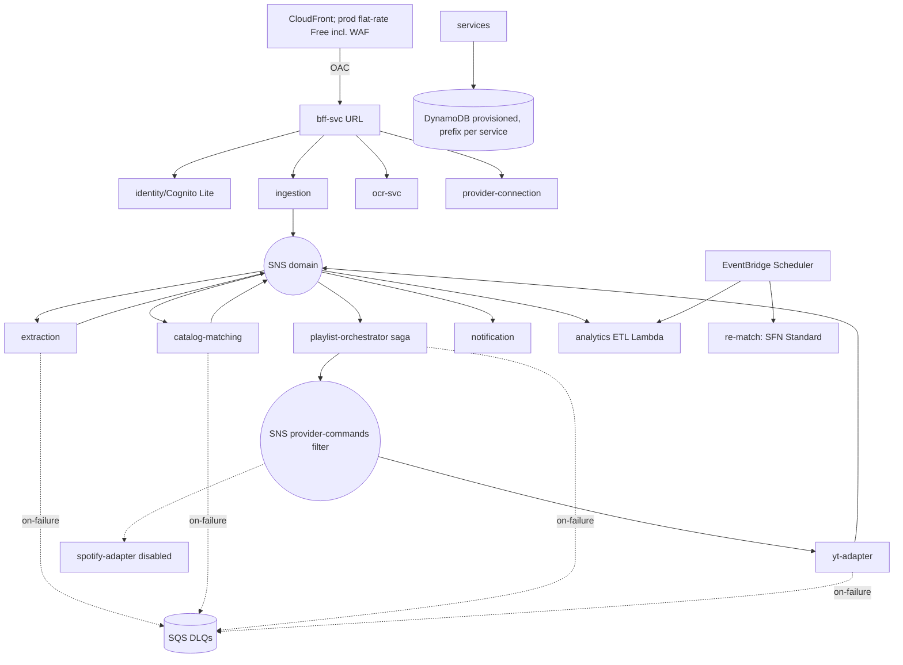
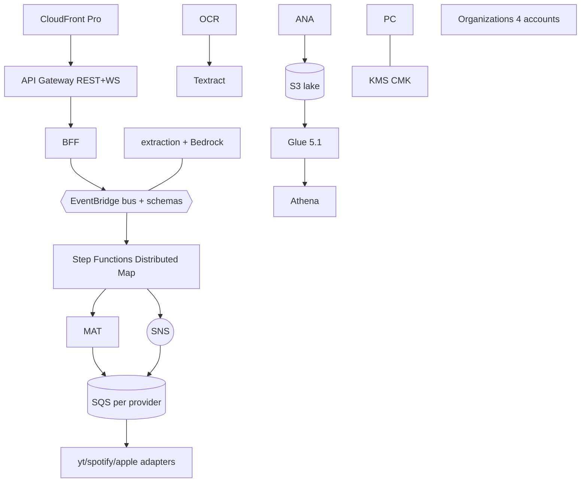
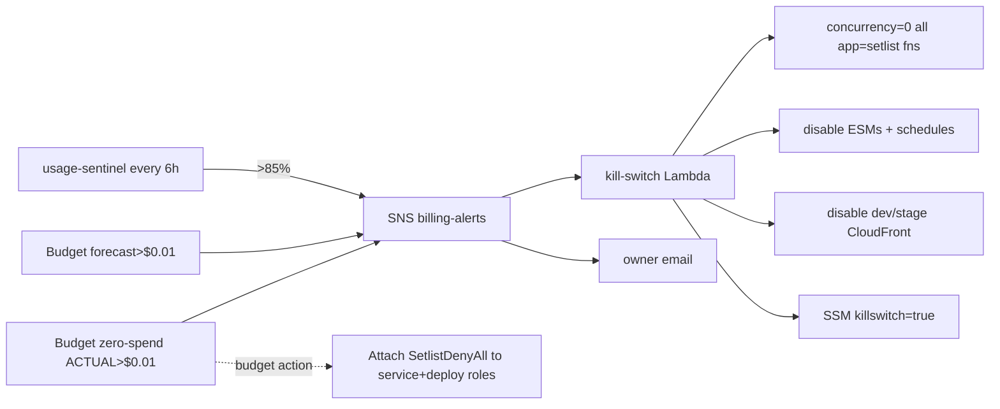
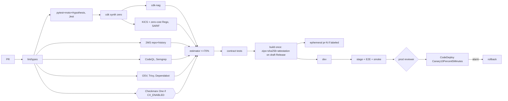
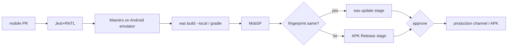

# Setlist Mobile & Serverless Expansion — Project Expansion Document (PED v1.0)

> **Provenance.** Transcribed from the PED v1.0 text supplied on 2026-09-28. If you
> hold a cleaner original, replace this file wholesale — nothing generates from it.
>
> **Amendments are applied inline.** Each one is marked with a callout naming the ADR
> that authorised it; `spec-amendments.md` is the changelog of what changed and when.
> Precedence is `plan/AUTOPILOT.md` and `adr/` > **PED** > PRD.

**Verdict:** You can build and run the Setlist mobile scanner, the microservices backend and dev/stage/prod environments at a true $0, but only on a re-selected set of AWS services. For accounts opened after July 15, 2025, API Gateway, S3, EventBridge custom events, Step Functions Express, Glue ETL, Athena, Textract, Rekognition, Bedrock, standalone WAF and Secrets Manager are not free, so each is swapped out, capped or put behind a flag. The real scale limits are YouTube's 10,000 units/day, Spotify's 5-user Premium-gated dev mode, and Apple's $99/yr program, which blocks every native iOS path.

## TL;DR

- **Feasible at $0, with conditions.** Use one AWS account, not AWS Organizations: joining one upgrades a free-plan account to paid and ends its credits. Run the "$0 profile": Lambda Function URLs behind CloudFront, SNS as the event bus, provisioned DynamoDB, no SQS pollers, on-device OCR first, and a deterministic parser instead of Bedrock. A KICS + cdk-nag policy gate enforces this in CI, and a budget-driven kill switch backs it up.
- **The binding constraint is YouTube quota, not AWS.** A 15-song playlist costs 800 units (50 + 15 × 50), which gives about 250 prod playlists/month after the dev/stage split. The same traffic uses about 1% of the Lambda allowance. Spotify's February 2026 migration guide says dev-mode apps need the owner to hold an active Premium subscription, and TechCrunch reports a cap of 5 users per app (down from 25). Apple Music and the iOS App Store are impossible at $0.
- **Ship Android + PWA now.** Android: React Native + Expo, local builds, APK on GitHub Releases. PWA for iOS. Checkmarx KICS + 2MS are the blocking security gate, and Checkmarx One is wired but dormant until a license exists. Upgrade triggers: Google Play ($25), Apple Developer Program ($99/yr), and a small AWS budget for the "enterprise profile" (same code, turned on by CDK flags).

---

## 1. Document control and delta summary

| Field | Value |
|---|---|
| Version / date | PED v1.0 — 2026-09-28; extends Setlist PRD v1.0 |
| Implementer | Claude Code, with the human-in-the-loop (HITL) checkpoints in §18 |
| Budget | Hard $0/month: no paid AWS, SaaS or developer programs |
| Facts | Checked against official 2025–2026 pages. **[UNVERIFIED]** items must be re-checked at the M0 gate. |

| # | Base PRD | $0-profile decision | Reason |
|---|---|---|---|
| D1 | API Gateway REST + WebSocket | Lambda Function URLs behind CloudFront OAC; push + polling instead of WebSocket | API Gateway's free offers are "only available to new AWS customers... for 12 months" (credits only for new accounts). Lambda is always free. |
| D2 | CloudFront + WAF | Prod distribution on the CloudFront flat-rate **Free plan** (bundles WAF, DDoS, TLS) | Standalone WAF is billed |
| D3 | EventBridge bus | SNS topics as the event bus. EventBridge **Scheduler** only (14M free invocations). | Custom events have no free tier. Only AWS management events are free. |
| D4 | Step Functions for jobs | Lambda saga with state in DynamoDB. Step Functions Standard for batch only. | 4,000 free transitions; Express has no free tier |
| D5 | SNS→SQS→Lambda pollers | SNS→Lambda async invoke, with on-failure destinations to SQS DLQs | Idle pollers burn the 1M free SQS requests |
| D6 | DynamoDB single table | Provisioned, one table per env, IAM `LeadingKeys` prefix per service; ≤17 WCU/RCU total | 25 WCU/25 RCU are provisioned-only and shared across tables and GSIs |
| D7 | KMS CMK envelope | AES-GCM data key in an SSM SecureString (`aws/ssm`), cached per cold start | A CMK costs $1/month |
| D8 | S3 lake + Glue 5.1 + Athena | ETL module runs as a scheduled Lambda; Glue Data Catalog only; Glue jobs behind a flag | S3 is credits-only; Athena has no free tier; Glue ETL is paid |
| D9 | Bedrock Haiku 4.5/Sonnet 4.6 | Deterministic parser + on-device LLM; Bedrock behind a flag | Bedrock is credits-only |
| D10–11 | Secrets Manager, AppConfig | SSM Parameter Store for secrets and flags | Secrets Manager is billed per secret. **[UNVERIFIED: AppConfig price]** |
| D12 | Canary on every Lambda | CodeDeploy canary in prod only, ≤5 alarms | 10 free alarm metrics |
| D13–14 | SES, AWS FIS | Push + in-app inbox; fault injection via flags | SES free tier is 12-month/legacy only; FIS is paid |
| D15 | 4 accounts under Organizations | 1 account, per-env stacks | The AWS Free Tier FAQs say that when an account joins an Organization, its Free Tier credits "expire immediately" and the free plan is "automatically upgraded to a paid plan"; the free tier is also aggregated across the org |
| D16 | search.list = 100 units | search.list has its own default bucket of 100 calls/day | YouTube quota page, updated 2026-09-14 |
| D17–18 | Spotify, Apple in Phase 4 | Spotify conditional on the owner having Premium; Apple deferred | Feb 2026 Spotify dev-mode rules; $99/yr Apple program |
| D19 | LocalStack | moto server, DynamoDB Local, ElasticMQ | LocalStack's blog says Community edition support ended March 23, 2026. The single remaining image needs a user account and auth token, and the free tier is for non-commercial use only. |

---

## 2. Executive summary and feasibility verdict

**GO for the $0 profile.** Hard exclusions: iOS App Store/TestFlight, Apple Music, Amazon Music. Spotify is conditional.

What gets built:

- An Android-first Expo app (plus a PWA for iOS). It scans handwritten lists, flyers or screenshots, runs OCR on the device, extracts pairs with the base parser in deterministic mode, and creates a YouTube playlist on its own when every item is ≥0.8. Anything else goes to review.
- 13 independently deployable Lambda microservices.
- 3 environments in one account, deployed by GitHub Actions + OIDC with Checkmarx gates.

**Safety layers:**

1. **Preventive:** a CI policy gate.
2. **Structural:** no idle-billing resources.
3. **Runtime:** concurrency caps and quotas.
4. **Corrective:** zero-spend budget → SNS → kill switch, plus an IAM-deny budget action. Budgets without actions are free, and the first two action-enabled budgets are free.

**Account plan:**

- **New account:** start on the Free plan (no charges; closes after 6 months or when credits run out). Once M4 shows ≥30 days at $0, upgrade to Paid in month 5 so the always-free allowances continue. The Terms say that after expiry you "will need to upgrade... within 90 days" or AWS "will permanently close your account".
- **Pre-July-2025 account:** use it as is. The design depends only on always-free limits.

---

## 3. Goals and non-goals

**Goals:**

- G1: Scan to playlist with no typing.
- G2: Autonomous creation at ≥0.8 confidence.
- G3: $0 forever in all environments.
- G4: Enterprise microservice practices (bounded contexts, versioned events, idempotency, DLQs, observability).
- G5: One codebase, two profiles.
- G6: Checkmarx as the security gate.

**Non-goals:**

- Native iOS distribution.
- Apple Music and Amazon Music.
- WebSockets in the $0 profile.
- Custom domains.
- Storing images on the server.

---

## 4. Personas and user stories

- **Dana** (handwritten setlists, Android). **US-1:** She photographs a 12-song handwritten page. The app deskews it and runs OCR on the device. If all items are ≥0.8 the playlist is created automatically; otherwise review opens with the uncertain items first.
- **Felix** (festival posters). **US-2:** For artist-only lines, the app offers "top tracks", capped at 3 per artist, and shows the quota cost first.
- **Sam** (iOS PWA, screenshots). **US-3:** Sam shares a screenshot through Web Share Target. If the device can't run OCR, a Lambda does it in memory and discards the image.
- **Any user. US-4:** Turns on "Create automatically". Scans taken offline queue on the device, sync on reconnect, and a push notification reports "11/12 songs, 1 needs review".
- **Owner. US-5:** When usage reaches 85% of any limit, or spend goes above $0.00, non-essential functions throttle to 0 and the owner gets an email.

> **Amendment pending verification — [ADR-003](adr/0003-build-order-m0-first.md), task M5-03.**
> US-3 assumes iOS Safari supports Web Share Target. That is unconfirmed. If it is
> absent, iOS PWA users import through the file picker instead, and this story is
> amended accordingly at M5.

---

## 5. Zero-Budget Feasibility Matrix

| Item | Cost if used | $0 alternative / config | Decision |
|---|---|---|---|
| AWS Organizations / extra accounts | Plan upgrade; credits end; "not eligible to receive Free Tier Credits for more than one account" | Single account | Reject |
| API Gateway | Credits-only | Function URLs + CloudFront OAC | Replace |
| CloudFront | Pay-as-you-go beyond allowance | Prod on flat-rate Free plan (1M requests, 100 GB, WAF); dev/stage on pay-as-you-go always-free | Adopt |
| Route 53 / custom domain | Monthly + registration | `*.cloudfront.net` | Defer |
| S3 | Credits-only for new accounts | CDK asset bucket with 1-day lifecycle; SPA on the flat-rate plan's S3 credits | Adopt, risk R6 |
| EventBridge custom bus | Per event | SNS | Replace |
| Step Functions Express / hot-path Standard | Paid / >4,000 transitions | Lambda saga; Standard ≤2,000/month in prod | Constrain |
| SQS pollers | Idle requests | SNS→Lambda + DLQ | Replace |
| DynamoDB on-demand | Billed per request | Provisioned ≤17 WCU/RCU | Replace |
| KMS CMK / Secrets Manager | $1/key/month / per secret | SSM SecureString | Replace |
| NAT, VPC Lambdas, provisioned concurrency | Hourly | None | Never use |
| Textract | 1,000 pages/month for 3 months, then $1.50/1,000 | On-device OCR + ONNX in Lambda | Flag |
| Rekognition, Comprehend | 12-month/legacy only | Same | Reject |
| Bedrock (Haiku 4.5, Nova Lite) | Per token; no free tier | Deterministic parser + on-device LLM | Flag |
| Glue ETL | Python shell daily ≈ $0.014/month | ETL as a Lambda | Flag |
| Athena | $5/TB, 10 MB minimum per query | DuckDB locally | Defer |
| SES, FIS, Device Farm, Amplify | Legacy/paid/trial | Push; flag-based faults; emulator; CloudFront | Replace |
| CodeBuild/CodePipeline | 100 build-min, 1 V1 pipeline always free | GitHub Actions | Not used |
| ECR | Storage | Zip-packaged Lambdas only | Avoid |
| Checkmarx One | Sales-quoted; Checkmarx's own AWS Marketplace listing sets a "Minimum Deal size" of USD 30,000 for a 1-year term | KICS + 2MS (open source) | Dormant drop-in |
| GitHub private repo | 2,000 min/month; macOS 10× | Public repo (free standard runners) | Public |
| Expo EAS | Free: 15 Android + 15 iOS builds/month, 1,000 update MAU; Expo's billing FAQ says "Free plan accounts do not incur overage charges" | Local builds | Free plan |
| Google Play | $25 one-time registration fee for full distribution (Google Play Console Help) | APK on GitHub Releases | Defer |
| Apple Developer Program | $99/yr | PWA; free-Apple-ID sideload for the owner only | Defer |
| Spotify | Owner Premium required | Skip unless the owner has it | Conditional |
| Apple Music / Amazon Music | $99/yr / closed beta | — | Impossible |

---

## 6. AWS Free Tier constraints table (all environments; gate is ≤70%)

| Service | Allowance | Type (post-7/2025) | Planned / month | Headroom | Guardrail |
|---|---|---|---|---|---|
| Lambda | 1M requests; 400,000 GB-s | Always free (not for provisioned-concurrency functions) | 310k requests; 120k GB-s | 69% / 70% | arm64; reserved concurrency; kill switch |
| API Gateway | 1M calls/messages | 12-month / credits | 0 | — | Banned in the $0 profile |
| CloudFront prod | Flat-rate Free: 1M requests, 100 GB | $0 plan, no overages | 350k requests | 65% | Plan alerts at 50/80/100% |
| CloudFront dev/stage | 1 TB, 10M requests always free **[sources conflict]** | Always free | 60k requests | >99% | Disabled by the kill switch |
| S3 | Legacy 5 GB | Credits only | <50 MB | billable | Lifecycle rules |
| DynamoDB | 25 WCU, 25 RCU, 25 GB | Always free, shared across tables and GSIs | 17/17 | 32% | CI sum check |
| SQS | 1M requests | Always free | 10k | 99% | No event source mappings |
| SNS | 1M publishes; 1,000 email; no per-message charge for Lambda/SQS delivery | Always free | 190k | 81% | ≤64 KB messages |
| EventBridge | Custom events: none; Scheduler: 14M | Paid / free tier | 0 / <5k | >99% | Bus banned |
| Step Functions | Standard 4,000 transitions; Express none | Always free / paid | 2,800 | 30% | Estimator |
| Cognito Lite/Essentials | 10,000 MAU per account or org; Plus has no free tier; M2M not free | Always free | ≤7,000 cap | 30% | Lite tier |
| SSM standard parameters | Free **[UNVERIFIED]** | — | ~60 | — | No advanced tier |
| KMS | 20,000 requests; AWS-managed key calls count | Always free | 6k | 70% | Cache data key |
| CloudWatch | 10 metrics, 10 alarms, 5 GB logs, 3 dashboards, 1M API requests | Always free | 7 / 7 / 3.5 GB / 2 | 30% | Retention 3/7/14 days |
| X-Ray | 100k traces recorded | Always free | 70k | 30% | 5% sampling |
| Glue Data Catalog | 1M objects / 1M requests | Free | <100 | >99% | — |
| Glue ETL, Athena, Textract, Rekognition, Bedrock, SES | None / legacy | Paid / credits | 0 | — | Flags |
| Data transfer out | 100 GB aggregated | Always free | <10 GB | 90% | Egress via CloudFront |
| Budgets / Cost Anomaly Detection | Free; 2 action budgets free, then $0.10/day | Free | 3 budgets, 2 with actions | — | Never a 3rd action budget |

> **Implementation note.** These numbers live as data in
> [`infra/free-tier/budget.yaml`](../infra/free-tier/budget.yaml), read by both the CI
> estimator and the runtime sentinel so the gate and the trip cannot diverge.

---

## 7. Functional requirements

| ID | Requirement | MoSCoW | Acceptance criteria |
|---|---|---|---|
| FR-M-001 | Document camera capture: edges, perspective, multi-page | Must | A 3-page scan produces 3 pages with skew ≤2° |
| FR-M-002 | Gallery import (JPEG/PNG/HEIC/WebP) | Must | HEIC converted on the device; downscaled to 2,048 px |
| FR-M-003 | Share sheet (Android intents; PWA Web Share Target) | Must | Shared text skips OCR |
| FR-M-004 | Blur/glare/skew checks | Must | Retake prompt in <300 ms |
| FR-M-005 | On-device OCR (ML Kit v2; iOS Vision; Tesseract.js in the PWA) | Must | Lines + boxes + confidence |
| FR-M-006 | Server OCR fallback when confidence <0.6 | Should | Image never persisted; p95 <8 s; max concurrency 2 |
| FR-M-007 | Deterministic hybrid parser with span grounding | Must | 0 ungrounded songs |
| FR-M-008 | On-device LLM for ambiguous lines | Could | Output rejected unless it is a substring of the OCR text |
| FR-M-009 | Crossed-out detection | Should | ≥90% excluded on the golden set |
| FR-M-010 | Matching thresholds 0.8 / 0.5 | Must | Same as base PRD |
| FR-M-011 | Autonomous creation | Must | Wrong-song rate <2% |
| FR-M-012 | Offline queue with idempotency keys | Must | 10 queued scans sync exactly once |
| FR-M-013 | Push on job completion | Should | p95 <60 s; no song names in payload |
| FR-M-014 | Backend-mediated OAuth | Must | No provider tokens on the device |
| FR-M-015 | dev/stage/prod app variants | Must | All 3 install side by side |
| FR-M-016 | Quota awareness and deferral | Must | No quotaExceeded shown to users |
| FR-M-017 | EXIF/GPS strip; 24 h local image TTL | Must | Privacy tests pass |
| FR-M-018 | Multilingual OCR | Should | CER reported per language |
| FR-M-019 | Accessibility | Must | 0 critical issues (axe / Android Accessibility Scanner) |
| FR-M-020 | Artist-only expansion | Could | ≤3 tracks/artist, ≤30 items |

> **Amended — [ADR-001](adr/0001-parser-home-typescript-core.md).** FR-M-007's parser is
> `packages/core`, TypeScript + zod, the single grammar for device, PWA and Node
> Lambdas. Span grounding is enforced by the core itself, so FR-M-008's substring rule
> is subsumed: the grounding gate is strictly stronger, checking token coverage and
> capping span size rather than testing for a substring.

> **Amended — [ADR-002](adr/0002-line-orientation.md).** FR-M-011 additionally requires
> that autonomous creation never proceeds on an unresolved line orientation, even when
> every item is at or above 0.8.

## 8. Non-functional requirements

| ID | Target |
|---|---|
| NFR-M-001 | $0.00 actual spend every month |
| NFR-M-002 | Projected usage ≤70% of every limit (CI); runtime trip at 85% |
| NFR-M-003 | On-device scan → preview p95 <4 s |
| NFR-M-004 | 15-song scan → playlist p95 <60 s; 50 songs <120 s (MusicBrainz ~1 req/s **[UNVERIFIED]**) |
| NFR-M-005 | 99.5% availability (base PRD said 99.9%; single Region) |
| NFR-M-006/007 | Cold start p90 <2.5 s; crash-free ≥99.5% |
| NFR-M-008 | 0 high/critical security findings |
| NFR-M-009 | 0 images or GPS data retained on the server |
| NFR-M-010/011 | 100% correlation IDs; each service deploys in <10 min |
| NFR-M-012 | TTLs: items 90 days, match cache 180 days, prod logs 14 days |

---

## 9. Mobile app architecture

**Framework:** React Native + Expo (latest stable SDK pinned at M0; TypeScript; Development Builds).

- It shares `packages/core` (zod schemas, parser, API client) with the React web app.
- Expo Modules wrap Vision and ML Kit.
- Flutter would duplicate the domain model in Dart. Fully native apps would double the UI work.

> **Amended — [ADR-001](adr/0001-parser-home-typescript-core.md).** `packages/core` is
> shared more widely than this section states: **`services/extraction` and
> `services/catalog-matching` import the same package as Node Lambdas**, so exactly one
> grammar exists across device, PWA and server. Hermes is treated as a real target —
> NFKC and regex Unicode property escapes are verified there and polyfilled where they
> differ, proven by the M1-04 self-test screen that Maestro drives in CI.

```mermaid
flowchart LR
  A[Camera/Gallery/Share] --> B[Doc scanner: ML Kit Document Scanner / VisionKit / getUserMedia]
  B --> C[Quality checks] -- fail --> A
  C --> D[EXIF strip + downscale]
  D --> E[On-device OCR: ML Kit v2 / Vision RecognizeDocumentsRequest / Tesseract.js]
  E --> F{conf >= 0.6?}
  F -- no --> G[ocr-svc Lambda PP-OCR ONNX in-memory]
  F -- yes --> H[Deterministic parser]
  G --> H
  H --> I{ambiguous?} -- yes --> J[On-device LLM, span-grounded]
  I -- no --> K[Upload text+spans]
  J --> K --> L[ingestion -> extraction -> matching]
  L --> M{all >= 0.8 and quota?}
  M -- yes --> N[Create playlist] --> P[Push]
  M -- no --> O[Review]
```



**OCR engines:**

- **Android:** ML Kit Text Recognition v2 is aimed at printed text, so handwriting is expected to be weak **[UNVERIFIED benchmarks]**. The server fallback and LLM repair cover this.
- **iOS 26:** `RecognizeDocumentsRequest` reads structure "like tables, lists" in 26 languages. It falls back to `VNRecognizeTextRequest(.accurate)`.

**On-device GenAI:**

- **iOS 26 Foundation Models:** text only.
- **iOS 27 (WWDC26):** adds multimodal prompts. Only reachable in the owner's sideloaded build.
- **Android Gemini Nano Prompt API:** accepts text + image. Needs a supported device, API 26+ and a locked bootloader; always call `checkFeatureStatus()`. Best on Pixel 10 (nano-v3).



**OAuth rules:**

- The provider redirect is always HTTPS on our CloudFront domain. That avoids Google native-client custom-scheme limits and Spotify redirect rules **[UNVERIFIED exact 2026 rules; irrelevant with backend mediation]**.
- Android App Links use `assetlinks.json` served from CloudFront.
- iOS universal links need the paid program, so iOS uses custom schemes.
- Cognito tokens are stored in `expo-secure-store`.

**Offline:** SQLite queue holding text, spans and a UUIDv7 idempotency key. Backoff runs from 1 s to 5 min. The server deduplicates with Powertools idempotency. Parsing works offline.

**Push:** Expo push → FCM (Firebase Spark). APNs needs the paid program, so iOS gets PWA Web Push **[UNVERIFIED iOS Safari behavior]**. SNS mobile push is not used.

**Variants:**

| Variant | applicationId | Scheme | EAS channel |
|---|---|---|---|
| dev | `com.setlist.app.dev` | `setlist-dev` | dev |
| stage | `com.setlist.app.stage` | `setlist-stage` | stage |
| prod | `com.setlist.app` | `setlist-prod` | production |

`app.config.ts` reads `APP_VARIANT` to set the package, scheme, API URL and update channel. `runtimeVersion` uses `fingerprint`.

**Distribution at $0:**

- **Primary:** APK on GitHub Releases.
- **iOS:** PWA (camera via `getUserMedia`, Web Share Target).
- **Owner testing on iOS:** free-Apple-ID sideload with ~7-day provisioning **[UNVERIFIED]**.
- **Rejected:** F-Droid (ML Kit is proprietary; YouTube dependence triggers the NonFreeNet anti-feature **[UNVERIFIED]**).
- **Unlocks with money:** Play ($25), App Store/TestFlight/MusicKit ($99/yr).
- **Builds:** `eas build --local` on GitHub runners. EAS cloud Free plan for ad-hoc builds.

---

## 10. Microservices architecture

### 10.1 $0 profile



### 10.2 Enterprise profile (`-c profile=enterprise`, same code)



| Component | $0 profile | Enterprise profile | Cost basis |
|---|---|---|---|
| Sync API | Function URLs | API Gateway | Per call |
| Events | SNS | EventBridge | Per million events |
| Orchestration | Lambda saga | Step Functions Distributed Map | Transitions >4,000 |
| Fan-out | SNS filter → Lambda | SQS + event source mapping | Polling requests |
| DB | 1 provisioned table/env | Per-service tables, on-demand | Request units |
| Crypto | SSM key | CMKs | $1/key/month |
| OCR / LLM | ONNX / on-device | Textract ($1.50/1,000 pages) / Bedrock | Per page / per token |
| Batch | Lambda ETL | Glue ($0.44, Flex $0.29/DPU-h) + Athena ($5/TB) | Usage |
| WAF | Flat-rate Free | Pro $15 / Business $200 per month | Flat |

Switching: `ProfileAwareFactory` in CDK builds the right resources for each profile. Runtime env vars select the transport: `EVENT_TRANSPORT`, `ORCHESTRATOR`, `OCR_FALLBACK`.

### 10.3 Service catalog

| Service | Responsibility | Publishes / consumes | Data prefix | Prod share |
|---|---|---|---|---|
| identity | Profile, deletion | pub `UserDeleted.v1` | `USR#` | 1 WCU/1 RCU |
| provider-connection | OAuth, token vault | pub `ProviderConnected.v1`, `ProviderTokenRevoked.v1` | `CONN#` | 1/1; 3k KMS requests |
| ingestion | Scans, idempotency, quotas | pub `ScanSubmitted.v1` | `SCAN#`, `IDEMP#` | 1/1 |
| ocr | Sync fallback OCR (2,048 MB) | — | none | 60k GB-s |
| extraction | Parse + grounding | `ScanSubmitted` → `SongsExtracted.v1` | `EXT#` | 1/1 |
| catalog-matching | ISRC-first, fuzzy, cache | `SongsExtracted` → `SongsMatched.v1` | `MC#` | 2/2 |
| playlist-orchestration | Saga, compensation | → `CreatePlaylistRequested.v1`, `JobCompleted.v1` | `JOB#`, `ITEM#` | 1/1 |
| yt-adapter | YouTube API + unit bucket | → `PlaylistCreated.v1`, `ProviderCallFailed.v1` | `RL#yt` | 1/1 |
| spotify/apple/amazon adapters | Same port; disabled | — | — | 0 |
| notification | Expo push, inbox | consumes `JobCompleted` | `DEV#`, `INBOX#` | 1/1 |
| analytics | ETL, usage sentinel | pub `UsageThresholdCrossed.v1` | `AGG#` | 1/1 |
| bff | Auth, aggregation | — | none | 60k requests |
| config | Flags, kill-switch state | pub `FlagChanged.v1` | SSM | — |

- Each service has its own CDK app (`setlist-{env}-{svc}`) and a path-filtered workflow.
- The platform stack (topics, table, Cognito, CloudFront) shares its values through SSM parameters.

> **Amended — [ADR-004](adr/0004-language-map.md).** Runtime language per service is
> now explicit: **Node/TypeScript is the default for every service in this table.**
> Python 3.13 is used only for `ocr` (RapidOCR is Python-first; it returns raw lines
> and contains no grammar, so it cannot drift from the core) and for `packages/etl`
> (Glue compatibility). `extraction` and `catalog-matching` are Node and import
> `packages/core` directly rather than reimplementing the parser — see
> [ADR-001](adr/0001-parser-home-typescript-core.md).

### 10.4 Contracts, idempotency, retries

- **Envelope:** CloudEvents-style JSON (`id`, `type: setlist.<domain>.<Event>.vN`, `correlationid`, `idempotencykey`, `env`, `data`), ≤64 KB.
- **Schemas:** stored in `packages/contracts`, with generated TS and Pydantic types. Breaking changes create vN+1 and are dual-published for one release. SNS filtering uses message attributes (payload filtering is billed). Producer golden samples are verified by consumers in CI.
- **Retries:** Powertools `@idempotent` on `event.id`. Async invoke with `MaximumRetryAttempts=2` and `MaximumEventAge=1h`, then an on-failure DLQ. Redrive through `StartMessageMoveTask`.
- **Quota errors:** YouTube 429/quota failures are deferred to a Scheduler run at 00:05 PT.

> **Amended — [ADR-004](adr/0004-language-map.md).** Contracts are **zod-first**; JSON
> Schema is generated from the zod schemas for the Python consumers. A hand-maintained
> Python mirror of a zod schema is the same drift problem versioning exists to prevent.

### 10.5 Communication patterns

- **Sync:** CloudFront → Function URL (`AWS_IAM` + OAC). The BFF verifies the Cognito JWT against the cached JWKS.
- **Async:** choreography between services. Orchestration only inside playlist creation.
- **Why not Step Functions per job:** at about 8 transitions/job, prod's 2,000-transition share allows only about 250 jobs/month, so Step Functions runs only the weekly re-match.
- **Why no SQS event source mappings:** one poller at a 20-second long poll makes 3 × 60 × 24 × 30 = 129,600 requests/month on an idle queue. Lambda creates up to 5 pollers per event source mapping, and Mohamed Nabeem's Medium write-up "The Hidden Cost of Idle SQS Queues" reports "nearly 650,000 requests per month, even when no messages are delivered" on one queue. Eight queues across three environments would exceed 1M with no traffic.

### 10.6 Observability and security

**Observability:**

- Powertools JSON logs. Retention: 14 d (prod), 7 d (stage), 3 d (dev).
- 7 custom prod metrics: `ScanToPlaylistSuccess`, `WrongSongReported`, `YtUnitsUsed`, `AutonomousRate`, `OcrFallbackRate`, `FreeTierMaxPct`, `JobLatencyMs`.
- X-Ray at 5% sampling.
- 7 of 10 alarms used (prod: BFF 5xx, orchestrator errors, adapter errors, DLQ depth, FreeTierMaxPct; stage: 2).

**Security:**

- SSE with AWS-owned keys for DynamoDB and SQS.
- Messages carry IDs only.
- Tokens encrypted with AES-256-GCM using a data key from `/setlist/{env}/vault/dek`; the key ID is prefixed in the ciphertext for rotation.
- One IAM role per function, with `LeadingKeys` and a permission boundary that denies banned services.
- Apps cannot call `GenerateDataKey` on AWS-managed keys directly **[UNVERIFIED; the design does not depend on it]**.

> **Amended — [ADR-005](adr/0005-credentials-branches-deploys.md).** Observability must
> not itself cost money. CloudWatch `GetMetricData` and Logs Insights queries are
> **banned** alongside Cost Explorer: they are billed per call, so a monitoring loop
> would break the guarantee it was watching. Use `GetMetricStatistics` and Describe/List.

### 10.7 Glue strategy

`packages/etl` exposes `run(job, source, sink)`. The Lambda adapter reads the daily `EVT#` partitions and writes `AGG#` items. Glue Catalog definitions are created; Glue jobs are created only when `batch.glue.enabled`. Covers analytics, weekly re-matching and bulk import.

| Job (≤1 min; 1-minute minimum) | Per run | Daily ×30 | Weekly ×4.33 |
|---|---|---|---|
| Python shell 0.0625 DPU × $0.44 | $0.000458 | $0.0138 | $0.0020 |
| Spark 2 DPU | $0.01467 | $0.44 | $0.064 |
| Spark Flex 2 DPU × $0.29 | $0.00967 | $0.29 | $0.042 |
| Lambda 512 MB × 20 s | $0 (10 GB-s) | 300 GB-s | 43 GB-s |

No Glue option is $0, so Glue stays off.

### 10.8 Free-tier usage envelope

**Unit costs:**

- On-device scan: about 3 requests and 0.5 GB-s.
- Fallback OCR page: about 10 GB-s **[to be measured in M2]**.
- 15-song job: about 12 invocations and 8 GB-s. YouTube cost is 50 + 15 × 50 = 800 units, with ≤4 search.list calls from the separate 100/day bucket.

**Arithmetic (prod share):**

- **YouTube:** 7,000 units/day ÷ 800 = 8 playlists/day ≈ **250/month**. **Binds first.**
- **Lambda:** 200,000 GB-s − (250 × 8) = 198,000. At a 20% fallback rate a scan averages 2.5 GB-s, so about 79,000 scans.
- **CloudFront Free plan:** 700,000 requests ÷ 20 per session ≈ **35,000 scans**. Binds second.
- **MAU:** EAS Update Free allows 1,000 MAU (OTA updates stop beyond that). Cognito cap is 7,000.
- **Spotify:** 5 users.

> **Implementation note.** This arithmetic is encoded in
> [`infra/free-tier/usage-model.yaml`](../infra/free-tier/usage-model.yaml) and
> reproduced by the estimator's tests, so a change to the model that breaks the
> published numbers fails CI.

---

## 11. Environments at $0

| Option | Verdict |
|---|---|
| Single account, per-env stacks | **Chosen** (free-plan compatible) |
| Standalone accounts | Rejected (credits are per person; closure risk) |
| Organizations | Rejected (plan upgrade; one account gets the free tier) |
| Local dev | **Chosen:** moto server, DynamoDB Local, ElasticMQ, `sam local`, Step Functions TestState **[UNVERIFIED price]** |
| LocalStack Hobby | Optional (non-commercial, needs a token) |
| Ephemeral PR stacks | **Chosen:** `setlist-pr{N}` on label, 4-hour TTL, max 1, uses the stage share |

**Isolation:**

- Names `setlist-{env}-*`, plus tags.
- OIDC roles scoped to `environment:{env}`.
- Per-env permission boundaries.
- Separate Cognito pools and tables.

**Quota partitioning:**

| Limit | Total | prod | stage | dev | Reserve |
|---|---|---|---|---|---|
| Lambda GB-s | 400,000 | 200,000 | 50,000 | 30,000 | 120,000 |
| Lambda requests / SNS publishes | 1M each | 500k | 120k | 80k | 300k |
| SQS | 1M | 20k | 10k | 10k | 960k |
| DynamoDB WCU/RCU | 25/25 | 10 | 4 | 3 | 8 |
| Step Functions | 4,000 | 2,000 | 500 | 300 | 1,200 |
| Cognito MAU | 10,000 | 6,000 | 500 | 500 | 3,000 |
| Alarms / metrics | 10 / 10 | 5 / 7 | 2 / 0 | 0 / 0 | 3 / 3 |
| Logs GB | 5 | 2.5 | 0.6 | 0.4 | 1.5 |
| X-Ray traces | 100k | 50k | 15k | 5k | 30k |
| KMS | 20k | 10k | 2k | 2k | 6k |
| YouTube units/day | 10,000 | 7,000 | 1,500 | 500 | 1,000 |
| search.list/day | 100 | 70 | 20 | 10 | 0 |

`infra/free-tier/budget.yaml` holds these numbers for both the CI estimator and the runtime sentinel. The AWS DynamoDB pricing page says the free tier is granted "on a per Region, per-payer account basis", so moving dev to a second Region would add DynamoDB headroom. The design does not need it.

**Config/secrets:**

- SSM standard parameters under `/setlist/{env}/{config,flags,secrets}`, read with a 5-minute cache.
- No Secrets Manager.
- AWS access by OIDC only.

**Provider apps:**

- **YouTube:** one Google Cloud project with 3 OAuth clients. Policies require "exactly one (1) API Project for that API Client" and permit "separate API keys for test, dev, and prod environments". Separate projects are allowed only per distinct use case, never to add quota. The consent screen stays in Testing until beta **[UNVERIFIED test-user cap]**.
- **Spotify:** one dev-mode client, prod only. New apps get 5 users. Spotify's migration guide says: "As of July 2026, the Client IDs per developer limit has been increased to 25." Dev/stage use the simulator.

---

## 12. Cost guardrails and kill switch

**Runtime caps:**

- Reserved concurrency: BFF 5, ocr 2, others 2–3 **[UNVERIFIED: new accounts may have low concurrency quotas; request a free increase at M0]**.
- Per-user limits: 30 scans/day, 5 playlists/day, 4 MB images, 30 songs/job.
- YouTube token bucket.



**Timing:**

- Budget data lags by hours, so budgets are the backstop.
- The sentinel is the fast path: it computes GB-s from free vended metrics.
- Never call the Cost Explorer API; it is billed **[UNVERIFIED price]**.
- Recovery via `make unkill`, with owner confirmation.

**Never-use list** (cdk-nag + KICS HIGH):

- NAT Gateway and EC2/RDS/ELB.
- Lambda `VpcConfig`.
- `AWS::KMS::Key`.
- Secrets Manager.
- Provisioned concurrency.
- Standalone WAFv2.
- Route 53 hosted zones.
- DynamoDB `PAY_PER_REQUEST`, Standard-IA, PITR, global tables, or a provisioned sum above 17.
- Express state machines.
- API Gateway v1/v2.
- SQS event source mappings.
- Custom EventBridge buses.
- Glue jobs/crawlers (unless flagged).
- Log groups without retention; buckets without lifecycle rules.
- ECR / image-packaged Lambdas.
- More than 7 alarms, and Synthetics.
- FIS, Textract, Bedrock and SES grants.

**Policy-as-code:**

- `SetlistZeroCostPack` (a cdk-nag `NagPack`) fails `cdk synth`.
- KICS custom Rego queries in `security/kics-queries/zero-cost/` run on `cdk.out`.
- `tools/free-tier-estimate` combines the templates with `usage-model.yaml`, fails above 70% and comments on the PR.
- Infracost is Terraform-first with limited CloudFormation support **[UNVERIFIED]**, so it is advisory only.

> **Implementation note.** The never-use list is mirrored as data in
> [`infra/free-tier/budget.yaml`](../infra/free-tier/budget.yaml) (`never_use`), and
> task M0A-03 asserts the cdk-nag rule set against it so the two cannot drift.

---

## 13. CI/CD design

**Repository:**

- Public repo on GitHub Free. Standard runners are free for public repos, including macOS. Private repos get 2,000 min/month with macOS at 10×.
- Secret scanning with push protection, CodeQL, Dependabot, rulesets and environment reviewers are free for public repos **[UNVERIFIED per feature]**.
- Trade-off: the code is visible, so no secrets or golden images go in the repo.
- A $0.002/min self-hosted runner fee was announced for March 2026 and reportedly postponed. We use no self-hosted runners.



**Workflow practices:**

- Trunk-based, conventional commits, release-please semver per service.
- Reusable `_service.yml` with path filters. Changes in `packages/**` trigger all consumers.
- Artifacts stored on GitHub Releases (free), not S3.
- CodeDeploy canary for prod only (with an **[UNVERIFIED]** CodeDeploy-for-Lambda price).
- Manual rollback redeploys the previous release asset.

**Checkmarx gates:**

| Tool | Scope | Policy |
|---|---|---|
| KICS (`checkmarx/kics-github-action`, SHA-pinned) | CDK templates, workflows, OpenAPI | Fail on high/critical. Medium auto-creates an issue with a 14-day SLA. |
| 2MS | Full git history nightly; diff on PRs | Any finding fails the build; rotate the secret |
| Checkmarx One (`ast-github-action`) | SAST/SCA/IaC/secrets, PR decoration | Runs when `CX_ENABLED` is set; `--threshold "sast-high=1;sca-high=1;iac-security-high=1"` |
| Complements | CodeQL, Semgrep CE, OSV-Scanner, Trivy, MobSF | High/critical fail |

**Suppressions:** `security/suppressions.yaml` with owner, reason and `expires` ≤90 days. CI fails on expired entries.

**Checkmarx One licensing:** sales-quoted, with no public free tier. The free trial Checkmarx advertises is for its Developer Assist IDE agent, not a CI gate.

> **Amended — [ADR-005](adr/0005-credentials-branches-deploys.md), task PREP-03.**
> 2MS additionally runs **locally, over full history, in `scripts/hitl/github-setup.sh`
> before the repository is ever pushed**, and refuses to push on any finding. It fails
> closed when the scanner cannot run. Nightly CI history scanning is unchanged;
> `tools/check_no_secrets.py` is an *additional* CI check that also catches account ids,
> ARNs and personal data, not a substitute for 2MS.



**Mobile release details:**

- The keystore is generated offline and stored as a prod-environment secret, with a backup.
- Fastlane is deferred until store accounts exist.
- DORA metrics come from a `dora.yml` workflow over the GitHub API.

---

## 14. Testing strategy

**Unit, E2E and devices:**

- Unit: pytest + moto + Hypothesis; Jest + RNTL. Coverage ≥85% (core ≥90%).
- Mobile E2E: Maestro on a KVM emulator. Detox is rejected as heavier upkeep.
- Real devices: the owner's phones and Firebase Test Lab Spark quotas **[UNVERIFIED]**. The Device Farm trial is not used.

> **Amended — [ADR-004](adr/0004-language-map.md) and [ADR-006](adr/0006-test-data.md).**
> The test stack follows the language map:
>
> | Concern | TypeScript | Python (`services/ocr`, `packages/etl`) |
> | --- | --- | --- |
> | Unit | Vitest + fast-check + aws-sdk-client-mock | pytest + Hypothesis |
> | Mutation | Stryker — ≥70% `packages/core`, ≥65% elsewhere | mutmut ≥70% |
>
> Coverage floors are unchanged: ≥85% overall, ≥90% `packages/core`.
>
> Golden sets are **generated truth-first** from a MusicBrainz seed catalog: expected
> outputs derive from the catalog, never from parser output, because an agent that
> writes both the parser and its expectations will converge on a corpus its own bugs
> satisfy. Changing an expected output requires an ADR.

**OCR accuracy:**

- CER/WER measured with `jiwer`, plus song-level F1.
- Golden set: 150 handwritten pages from ≥10 consenting writers, 100 flyers and 100 screenshots, stored privately.
- The IAM Handwriting Database is non-commercial research only **[UNVERIFIED]**, so it is used for local benchmarks only.

**Payload tests:**

- HEIC/JPEG/PNG/WebP, 0-byte files, 4 MB + 1 byte, EXIF orientations 1–8.
- Bombs rejected by `MAX_IMAGE_PIXELS=40M`; polyglot, truncated, wrong-MIME and SVG files rejected.
- GPS stripped on the device and again on the server.

**Other suites:**

- **Batch/contract:** multi-page scans of 1, 5 and 20 pages; ETL against DynamoDB Local; Schemathesis on ephemeral stacks.
- **Load:** k6 locally against `sam local` + the simulator only.
- **Resilience:** flags `fault.yt.429`, `fault.ddb.throttle`, `fault.latency.ms`.
- **Security:** KICS, 2MS, MobSF, OWASP MASVS L1 / MASTG.
- **Accessibility:** axe, Android Accessibility Scanner.
- **Privacy:** no image bytes in logs, no files left in `/tmp`, 24 h device purge.
- **Free tier:** estimator on every PR; a nightly check flags ±25% drift between actuals and the model.
- **Mutation:** mutmut ≥70%, Stryker ≥65%.

| Phase | Unit | Contract | Integration | Mobile E2E | OCR acc. | Payload | Load | Resilience | Security | A11y | Privacy | Free-tier |
|---|---|---|---|---|---|---|---|---|---|---|---|---|
| M0 | ✓ | — | ✓ | — | — | — | — | — | ✓ | — | — | ✓ |
| M1 | ✓ | ✓ | ✓ | ✓ | — | — | — | — | ✓ | ✓ | ✓ | ✓ |
| M2 | ✓ | ✓ | ✓ | ✓ | ✓ | ✓ | ✓ | — | ✓ | ✓ | ✓ | ✓ |
| M3 | ✓ | ✓ | ✓ | ✓ | ✓ | ✓ | ✓ | ✓ | ✓ | ✓ | ✓ | ✓ |
| M4 | ✓ | ✓ | ✓ | ✓ | ✓ | — | ✓ | ✓ | ✓ | ✓ | ✓ | ✓ |
| M5 | ✓ | ✓ | ✓ | ✓ | — | ✓ | — | ✓ | ✓ | ✓ | ✓ | ✓ |
| M6 | ✓ | ✓ | ✓ | ✓ | — | ✓ | ✓ | — | ✓ | ✓ | ✓ | ✓ |
| M7–M8 | ✓ | ✓ | ✓ | ✓ | ✓ | ✓ | ✓ | ✓ | ✓ | ✓ | ✓ | ✓ |

---

## 15. Metrics

| Metric | GA target |
|---|---|
| Scan-to-playlist success | ≥95% |
| CER printed / handwriting | ≤3% / ≤12% |
| WER printed / handwriting | ≤8% / ≤25% |
| Song F1 printed / handwriting | ≥0.92 / ≥0.85 |
| Autonomous wrong-song rate | <2% |
| Autonomous rate | ≥60% printed / ≥35% handwriting |
| Scan → playlist p95 | <60 s |
| Crash-free / cold start | ≥99.5% / <2.5 s |
| On-device share | ≥80% |
| Cost per scan / bill | $0.00 / $0.00 |
| Free-tier headroom | ≥30% per service |
| Quality | Coverage ≥85%, mutation ≥70%, flaky <1%, 0 high/critical, 0 leaked secrets, KICS 100% |
| DORA | Weekly deploys, lead time <1 day, change failure rate <15%, MTTR <4 h |

- Base PRD text-extraction and matching targets still apply.
- SLOs: 99.5% availability, 98% job success, push p95 <60 s.

> **Amended — [ADR-002](adr/0002-line-orientation.md).** Two orientation targets join
> this table: parser-only orientation accuracy ≥90% on bare-dash lines, and ≥98% after
> matching — with zero YouTube units spent resolving it.

---

## 16. Phase plan

**Free-Tier Gate (FTG), required at every phase exit:**

- Projected usage ≤70% of every always-free limit.
- $0.00 actual spend.
- cdk-nag and KICS green.

| Phase | Deliverables | Entry / HITL | Exit conditions |
|---|---|---|---|
| M0 Foundations | Platform stack, kill switch, nag pack, KICS/2MS, estimator, OIDC | AWS account, MFA, budgets, public repo | Kill-switch drill <5 min; CI rejects a NAT PR; FTG |
| M1 Shell + auth | Expo app with 3 variants, bff, identity | Expo account | Variants side by side; MobSF 0 high; FTG |
| M2 Capture + OCR | OCR module, ocr-svc (ONNX zip ≤250 MB), payload suite | 50-page consented pilot set | CER ≤5% printed / ≤20% handwriting; ≤12 GB-s/page; FTG |
| M3 Extraction + matching | extraction, matching, contracts | M2 | F1 ≥0.88 / ≥0.78; 0 ungrounded songs; FTG |
| M4 Autonomous YouTube | Saga, yt-adapter, simulator, canary | GCP project, consent screen, 3 OAuth clients | Wrong-song <3%; canary rollback drill passes; 30 days at $0 → upgrade to Paid by month 5; FTG |
| M5 Offline + push + share | notification, sync, share intents | Firebase Spark | Exactly-once sync; push p95 <60 s; FTG |
| M6 Batch + PWA | analytics ETL, weekly re-match, PWA scan | M5 | Step Functions ≤2,000/month; PWA works on iOS Safari; FTG |
| M7 Beta | MASVS L1, full golden set, soak | ≥10 testers | §15 targets met; 14 days crash-free ≥99.5%; FTG with 30-day actuals |
| M8 GA | v1.0.0 APK + PWA | M7 | 30 days: success ≥95%, $0.00, ≥30% headroom |
| U1+ Unlocks | Play ($25); iOS + Apple adapter ($99); enterprise profile (≥$20/month) | Budget approved | Same code with `profile=enterprise`, within budget |

**Critical path:**

1. Golden-set consent collection (start at M0).
2. Google project + consent screen (M4).
3. Firebase (M5).
4. Beta testers (M7).
5. Google verification of the sensitive `youtube` scope (start at M6) **[UNVERIFIED duration]**.

> **Amended — [ADR-003](adr/0003-build-order-m0-first.md).** M0 is split at the
> credential boundary so nothing waits on a human: **M0a** (nag pack, KICS queries,
> estimator, workflows, bootstrap template, kill-switch and sentinel code) needs no AWS
> and starts immediately; **CORE** (the TypeScript port) also needs no AWS; **M0b**
> (bootstrap verification, `cdk bootstrap`, dev/stage deploys, kill-switch drill, canary
> PR, the M0 gate) runs after Session 1. The ledger in
> [`plan/TASKS.yaml`](plan/TASKS.yaml) is the authoritative decomposition.

---

## 17. Risks and mitigations

| # | Risk | Mitigation |
|---|---|---|
| R1 | Free plan auto-closes at 6 months | Reminder at month 4; upgrade after M4 |
| R2 | Paid-plan overage from a bug or abuse | Policy gate, caps, sentinel, zero-spend action; year-1 credits absorb small accidents |
| R3 | YouTube quota exhaustion | Token bucket, deferral, cache, avoid search; free quota audit later |
| R4 | Spotify limits and endpoint removals (search max 10; `/tracks`→`/items`) | Optional adapter coded against the post-Feb-2026 API surface |
| R5 | Weak handwriting OCR | Fallback, LLM repair, review, conservative threshold |
| R6 | Sub-cent S3 charges | Lifecycle rules, flat-rate S3 credits; if invoiced, move the SPA to GitHub Pages **[UNVERIFIED billing of sub-cent amounts]** |
| R7 | CloudFront always-free status conflicts across sources | Prod on the explicit $0 flat-rate plan |
| R8 | Low Lambda concurrency quota | Free increase request at M0 |
| R9 | EAS Free limits | Local builds; APK releases |
| R10 | Emulator drift | Ephemeral real-AWS stacks |
| R11 | Checkmarx One never licensed | KICS/2MS + CodeQL/Semgrep/OSV |
| R12 | Budget alert latency | 6-hour sentinel plus structural caps |
| R13 | Bedrock on the free plan: quotas can start at 0 and Marketplace offers may be blocked | Bedrock off; if credits, try Nova Lite first and verify Anthropic access |

---

## 18. Claude Code implementation addendum

**Monorepo additions:**

- `infra/` (nag pack, `free-tier/budget.yaml`, `usage-model.yaml`).
- `services/<svc>/{src,tests,infra,openapi.yaml}` for each of the 13 services, plus `kill-switch` and `usage-sentinel`.
- `packages/{core,contracts,etl,api-client}`.
- `mobile/` (with `modules/setlist-ocr`).
- `web/` (PWA).
- `tools/{free-tier-estimate,provider-simulator}`.
- `security/{kics-queries,suppressions.yaml}`.
- `tests/{e2e-maestro,k6}`.
- `golden/` (pointers only).

**CLAUDE.md block:**

```text
## COST GUARDRAILS (NON-NEGOTIABLE)
- Budget is $0. Never create resources on the never-use list (infra/nag/SetlistZeroCostPack.ts).
- Default profile `zero`; never use `-c profile=enterprise` unless the human says so this session.
- Deploys run only in CI; run `make preflight ENV=<env>` before pushing infrastructure changes. Abort on failure.
- Never call Bedrock, Textract, Rekognition, Glue StartJobRun, Athena, or Cost Explorer.
- Log retention, S3 lifecycle, PROVISIONED DynamoDB matching budget.yaml are mandatory.
- Never load-test AWS; use tests/k6 locally. Stop at every HITL checkpoint in docs/hitl/.
```

> **Amended — [ADR-005](adr/0005-credentials-branches-deploys.md).** The deploy line
> above replaces the original "Before ANY deploy: `make preflight`". Deploys run only in
> CI, so the local rule is to run `make preflight` before *pushing* infrastructure
> changes. The live text is in [`../CLAUDE.md`](../CLAUDE.md).

**Tooling:**

- **Hook:** a `PreToolUse` Bash matcher on `cdk deploy|sam deploy|aws cloudformation` runs `make preflight`. A non-zero exit blocks the command.
- **Subagents:** `cost-auditor`, `ocr-evaluator`, `contract-keeper`, `mobile-builder`.
- **Skills:** `add-microservice`, `add-event`.

> **Amended — [ADR-005](adr/0005-credentials-branches-deploys.md).** The hook is no
> longer a preflight wrapper on deploy commands. It is
> [`.claude/hooks/guard-bash.sh`](../.claude/hooks/guard-bash.sh), which blocks
> outright: `aws`, `cdk`/`sam` `deploy`/`destroy`, force pushes, pushes to `main`,
> `gh pr merge`, `gh secret` and destructive `gh api` calls. Deploying locally is not
> gated behind a check — it is not possible. A regression test
> (`tools/test-guard-hook.sh`) runs in `make verify`, because a guard that silently
> stops matching is worse than no guard.
>
> The subagent list gains **`reviewer`** (independent pre-integration review), and the
> skills gain **`/autopilot`** (the ledger loop) and **`/run-accuracy`**.

**Epics (Given/When/Then):**

- **E1 Platform:**
  - *Given* a NatGateway in a stack, *when* synth runs, *then* it fails with `SZC-NAT`.
  - *Given* a billing alert, *when* the kill switch runs, *then* every tagged function is at concurrency 0 within 60 s.
  - *Given* prod GB-s modelled at 300k, *when* CI runs, *then* it fails with "75% > 70%".
- **E2 Mobile:**
  - *Given* `APP_VARIANT=stage`, *then* the package is `com.setlist.app.stage`.
  - *Given* a GPS JPEG, *then* the queued bytes have no GPS IFD.
  - *Given* Laplacian variance <100, *then* a retake prompt shows and OCR does not run.
- **E3 OCR:**
  - *Given* a 4 MB handwritten page, *then* lines come back in <8 s and `/tmp` is empty.
  - *Given* a 50k×50k PNG, *then* 413/422 is returned.
- **E4 Extraction:**
  - *Given* `1. Wonderwall – Oasis` **with `sourceKind: scan_handwriting`**, *then* the result is `{title: Wonderwall, artist: Oasis}` with spans.
  - *Given* the same line with `sourceKind: paste`, *then* the parser emits `{title: Oasis, artist: Wonderwall}` on the artist-first prior **plus an `alternate`**, and matching resolves it to `{title: Wonderwall, artist: Oasis}` against MusicBrainz without spending YouTube quota.
  - *Given* an ungrounded LLM title, *then* it is rejected.
- **E5 Creation:**
  - *Given* 15 items ≥0.8 and 7,000 units, *then* the playlist is created and 800 units are debited.
  - *Given* 600 units left, *then* the job is deferred and the user notified.
- **E6 CI:**
  - *Given* a committed AWS key, *then* 2MS fails the build.
  - *Given* `CX_ENABLED`, *then* Checkmarx One decorates the PR and a SAST high fails it.
- **E7 Offline:**
  - *Given* 10 offline scans, *then* exactly 10 server-side jobs exist.

> **Amended — [ADR-002](adr/0002-line-orientation.md).** E4's first case gained an
> explicit `sourceKind`, and a second case was added. The original example — `1.
> Wonderwall – Oasis` yielding `{Wonderwall, Oasis}` — is correct for a scan and wrong
> for a paste, because orientation depends on the source. See the ADR for the full
> resolution ladder.

**HITL checklist:**

1. AWS Free-plan account, root MFA, admin user, us-east-1.
2. The three budgets (one with an IAM-deny action) and a Cost Anomaly Detection monitor.
3. Lambda concurrency increase if needed.
4. Enroll the prod distribution in the flat-rate Free plan in the console (CDK has no native support, per an open aws-cdk issue).
5. Google Cloud project, YouTube API, Testing consent screen, 3 web OAuth clients, secrets into SSM.
6. Spotify app, only if the owner has Premium.
7. Expo account and channels.
8. Firebase Spark + FCM credentials.
9. Android keystore, with a backup.
10. GitHub repo, rulesets, environments, OIDC.
11. Checkmarx One secrets, if a license or trial is offered.
12. Consented golden set.
13. Test devices (ideally a Gemini Nano-capable Android, plus any iPhone for the PWA).
14. Paid-plan upgrade approval in month 4–5.

> **Implementation note.** This checklist is expanded click-by-click into
> [`hitl/SESSION-1.md`](hitl/SESSION-1.md) through `SESSION-4.md`, with the durable
> queue in [`hitl/QUEUE.md`](hitl/QUEUE.md).

---

## 19. Open questions

1. Does the owner have Spotify Premium?
2. Is the AWS account new or legacy?
3. Are sub-cent S3 charges invoiced after credits run out?
4. Google `youtube`-scope verification: is it required, and how long does it take?
5. Is published handwriting OCR accuracy representative of our golden set? (Measure in M2.)
6. Should dev move to a second Region for more DynamoDB headroom, given the free tier applies "on a per Region, per-payer account basis" (AWS DynamoDB pricing page)?
7. Will Checkmarx offer a trial or OSS license?
8. Is the MusicBrainz rate limit still current?

## 20. References (official pages to re-verify at every gate)

- **AWS:** Free Tier FAQs and Terms; the Billing "Choosing a plan" guide; the serverless/DevOps free-tier pages; pricing pages for API Gateway, CloudFront (plus the flat-rate plans guide), S3, DynamoDB, EventBridge, Step Functions, Cognito, KMS, CloudWatch, X-Ray, Glue, Athena, Textract, Rekognition, SES, Bedrock and Budgets.
- **YouTube:** Quota and Compliance Audits; Developer Policies and the compliance guide.
- **Spotify:** quota modes; the February 2026 migration guide.
- **Expo:** pricing; billing FAQ.
- **GitHub:** Actions billing; the 2026 pricing changelog.
- **LocalStack:** the 2026 pricing announcement.
- **Checkmarx:** KICS docs and kics-github-action; 2MS; ast-github-action.
- **Apple:** WWDC25 "Read documents using the Vision framework"; the WWDC26 iOS guide.
- **Android:** ML Kit GenAI Prompt API.
